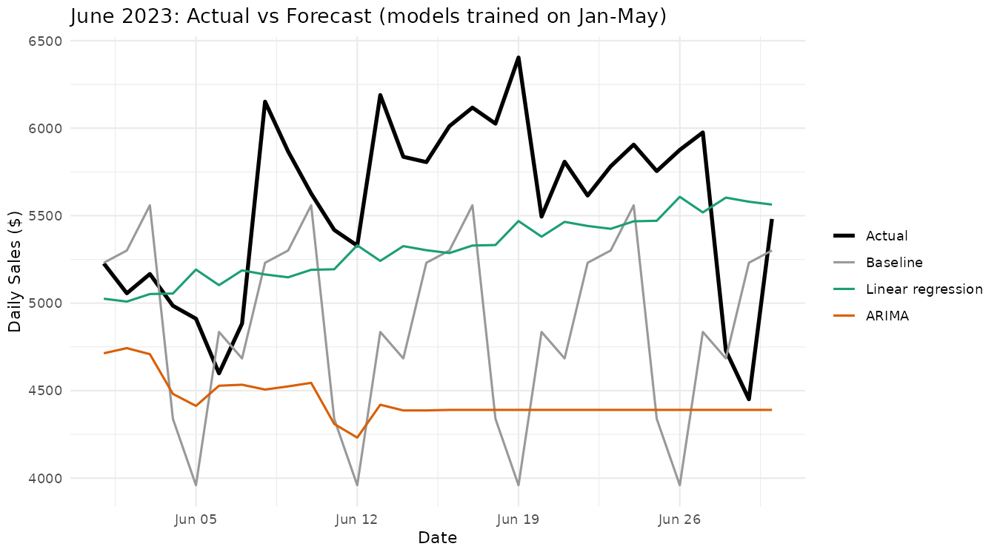
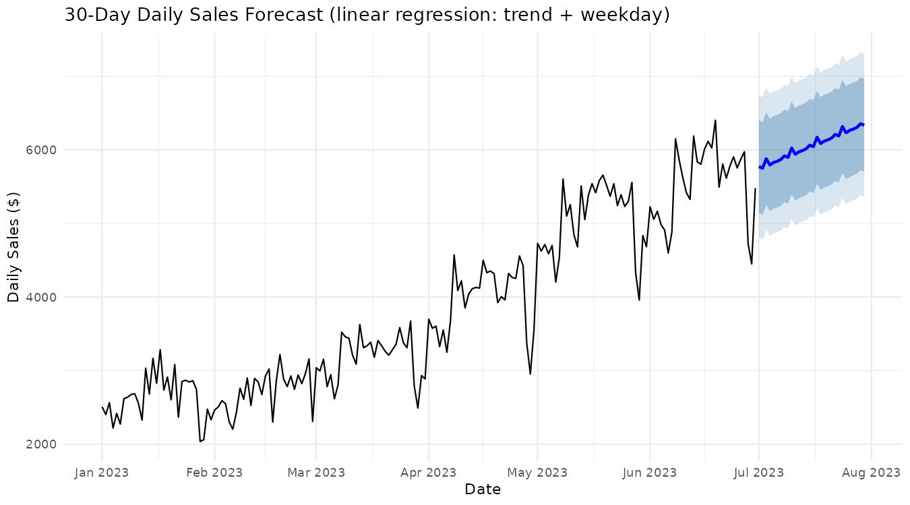
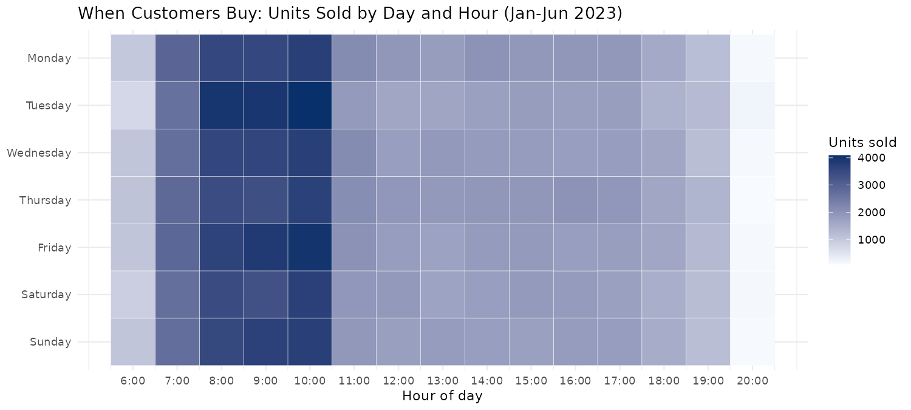

# Coffee Shop Sales Forecasting (R)

**Question:** How much will a coffee shop chain sell next month, when are its busiest hours, and what drives revenue — so managers can plan staffing and inventory?

Six months of transactions (149,116 sales across three New York locations, January–June 2023) were rolled up to daily sales. Four forecasting approaches were then tested **on the same unseen month** against a simple baseline.

**Tools:** R · dplyr · ggplot2 · forecast · neuralnet  
**Team:** Originally a five-person course project. This version — the date bug fix, fair model comparison and v2 analysis — was rebuilt by Jimmy Tran.

---

## Results

Every model was trained on January–May and asked to forecast June (30 days it had never seen).

| Model | Avg error per day (MAE) | Avg % error (MAPE) |
| --- | ---: | ---: |
| **Linear regression (trend + weekday)** | **$451** | **8.1%** |
| Baseline: same weekday last week | $788 | 13.8% |
| Neural network (average of 10 runs) | $809 | 14.6% |
| ARIMA (weekly seasonality) | $1,107 | 19.2% |



- **The simplest model won.** A trend line with a weekday adjustment cut forecast error **43% versus the baseline** and was the only model clearly better than it.
- **ARIMA missed the growth.** Trained on January–May, `auto.arima` chose a model without a trend term, so it forecast a flat ~$4,400–4,700 a day while June actually averaged $5,550.
- **The neural network was unreliable.** Depending on its random starting weights, its June error ranged from $389 to $2,333 a day. With only 151 training days, it couldn't beat the baseline on average.
- **Sales grew about $20 a day** (regression trend, strongly significant). Weekday effects were small (averages within ~3% of each other) and not statistically significant.

### July forecast

Refit on all six months, the linear regression forecasts about **$6,060 a day** in July 2023, rising from ~$5,770 to ~$6,340, with 80% and 95% prediction intervals.



### When customers buy

Demand peaks every morning from **8–10 AM**, and **10 AM is the busiest hour on every day of the week**. Tuesday and Friday mornings run slightly higher (Tuesday 10 AM: 4,092 units). The staffing takeaway is the daily morning rush, not particular weekdays.



### What drives revenue

Total revenue was about **$699K**. Coffee (38.6%) and tea (28.1%) bring in two-thirds of it, and espresso drinks are the top-earning product type. The top 10 individual items by units sold are within ~5% of each other, so sales are spread across a broad menu rather than driven by one star product. Ranking by revenue instead of units changes the leaders: Earl Grey sells the most units but is cheap; Dark Chocolate (large) is near the top on both.

---

## The date bug (and why the numbers changed)

The first version built each sale's date with `as.Date(datetime)`, which converts to UTC. On a computer set to U.S. Eastern time, sales after ~8 PM were counted as the next day. That created a **fake July 1, 2023** with 7 sales and $32, which appeared as a "sudden sales drop" and inflated ARIMA's error to 94% MAPE. The fix takes the date directly from `transaction_date`.

| | Before fix | After fix |
| --- | ---: | ---: |
| Days of data | 182 (1 fake) | 181 |
| ARIMA in-sample MAPE | 94.2% | 6.8% |

The first version also compared models unevenly: ARIMA was scored on data it was trained on, and the neural network predicted each day's sales from that same day's item count, which isn't a real forecast. Version 2 fixes both.

## Approach

1. **Prepare:** parse dates and times, extract hour and weekday, aggregate to daily units and revenue.
2. **Split by time:** train on Jan 1–May 31 (151 days), test on June 1–30 (30 days).
3. **Baseline:** seasonal naive — each June day is predicted as the same weekday one week earlier.
4. **Linear regression:** `total_sales ~ trend + day_of_week`.
5. **ARIMA:** `auto.arima` on a weekly-frequency time series.
6. **Neural network:** trend + weekday inputs only (information known in advance), two hidden layers (5, 3), trained 10 times with different seeds and judged on the average.
7. **Score:** MAE, RMSE and MAPE on June for every model.
8. **Forecast:** refit the winning model on all data and forecast July with prediction intervals.
9. **Describe:** day × hour heatmap; revenue by category and product.

## Limitations

- Six months of data: no yearly seasonality, and a single test month.
- June grew faster than the January–May trend, so even the best model under-forecast it.
- No outside factors (weather, holidays, promotions).
- Units and revenue only; no cost or margin data.

## Run it

1. Put `Coffee Shop Sales.csv` in the `data/` folder (the dataset is not included in this repo).
2. Install packages: `install.packages(c("dplyr", "ggplot2", "forecast", "neuralnet"))`
3. Open `R/coffee_sales_forecast.R` in RStudio and click **Source**. Results print to the console and the three charts appear in the Plots tab. Results are reproducible (fixed random seeds).

## Repository structure

```
├── README.md
├── R/
│   └── coffee_sales_forecast.R
├── charts/
│   ├── june_forecast_comparison.png
│   ├── july_forecast.png
│   └── peak_hours_heatmap.png
└── data/          # add Coffee Shop Sales.csv here (not tracked)
```

---

**Jimmy Tran** · [LinkedIn](https://www.linkedin.com/in/jimmytran8/)
